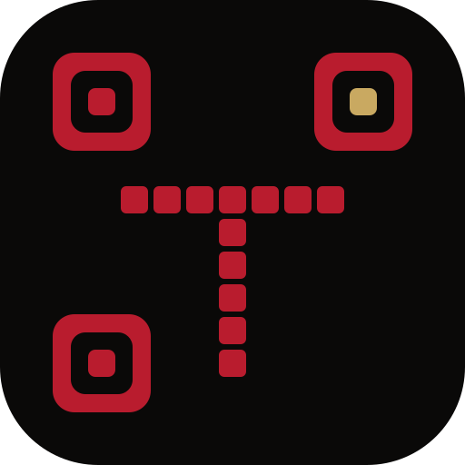

  

  # Targa

  **AI security for digital communities.**

---

Targa keeps online communities clean. It begins as a Telegram anti-spam bot and grows into a full security layer for the places people gather.

## The product

**Targa M1** — a free anti-spam bot for Telegram. Classical, non-LLM detection: fast, deterministic, and it explains every action it takes.

## Why Targa

- **Built for modern spam.** Closes the gaps that defeat rule-based bots today: homoglyph handles, edit-after-post attacks, image-text scams, admin impersonation.
- **Explainable.** Every action carries a structured reason. No silent bans.
- **Free.** M1 is the foundation every community gets, and it stays free.

## Where it's going

More layers on top of M1 — smarter detection, wallet-based identity gating across TON, Polkadot, SUI, and Base — and, beyond moderation, a security company for digital communities: threat intelligence, a live public Spam Index, and an in-house research arm.

## Status

Targa M1 is in **private beta**. Access is invite-only while we harden the foundation.

"Targa" is the everyday name. The company is <strong>Targa-Praetorian</strong> — shield and sword.
